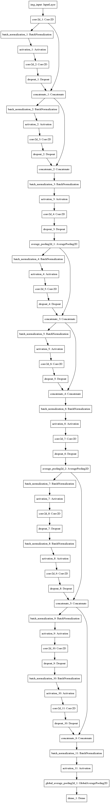

# DenseNet
Densely Connected Convolutional Network (DenseNet) is a network architecture where each layer is directly connected to every other layer in a feed-forward fashion. It's quite similar to ResNet but in contrast DenseNet concatenates outputs instead of using summation. If you need a quick introduction about how DenseNet works, please read the [original paper](https://arxiv.org/abs/1608.06993)[1]. It's well written and easy to understand.

I implemented a DenseNet in Python using Keras and TensorFlow as backend. Because of this I can't guarantee that this implementation is working well with Theano or CNTK. I will try to optimize this architecture in my own way with some modifications.
You can find several implementations on [GitHub](https://github.com/liuzhuang13/DenseNet#other-implementations).

## Requirements
- [Keras 2.x](https://keras.io/)
- [TensorFlow 1.x](https://www.tensorflow.org/)

## Usage
Feel free to use this implementation:<br>
```
import densenet
print('DenseNet-Version: %s' % densenet.__version__)
model = densenet.DenseNet(input_shape=(28,28,1), nb_classes=10, depth=10, growth_rate=25,
                          dropout_rate=0.1, bottleneck=False, compression=0.5)
model.summary()
```
This will build the following model:<br>
</kbd>

## References
[1] [Densely Connected Convolutional Networks](https://arxiv.org/abs/1608.06993)<br>
[2] [DenseNet - Lua implementation](https://github.com/liuzhuang13/DenseNet)

## Author
Christopher Masch
